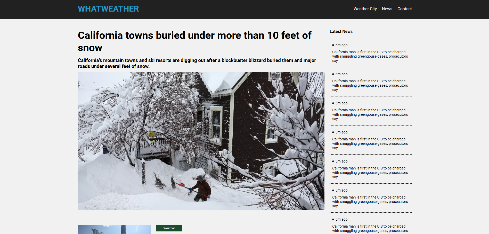

# ☁️ Weather App

**Weather App** is a modern and responsive weather forecast web application that allows users to search for cities, view current weather conditions, and see 5-day hourly forecasts using the OpenWeather API.

**Live Demo:** [https://whatweather-weather-site.netlify.app](https://whatweather-weather-site.netlify.app)

---

## 🖼️ Screenshots





> 📝 Replace the images above with actual screenshots from the Weather App.

---

## 🚀 Features

- 🔎 Search for city weather
- 🌦️ View real-time weather conditions
- 📅 5-day hourly forecast with weekday labels
- 🌡️ Switch between Celsius and Fahrenheit
- 📱 Fully responsive layout
- ⚡ Clean and smooth user experience

---

## 🛠️ Built With

- [React.js](https://reactjs.org/)
- [React Router](https://reactrouter.com/)
- [JavaScript (ES6+)](https://developer.mozilla.org/en-US/docs/Web/JavaScript)
- [OpenWeather API](https://openweathermap.org/api)

---

## 📦 Getting Started

To run this project locally:

```bash
# Clone the repository
git clone https://github.com/KKocbeler/weather-site.git

# Navigate to the project folder
cd weather-site

# Install dependencies
npm install

# Start the development server
npm start
